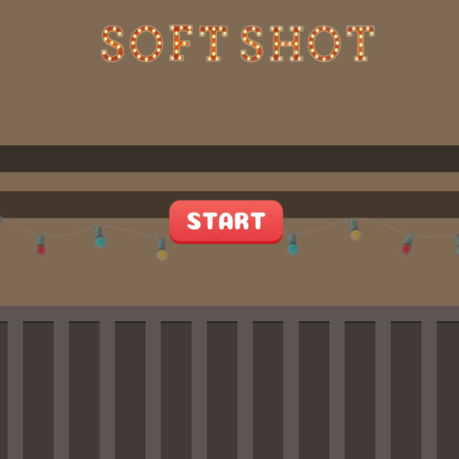

# Soft Shot

Bem-vindo ao Soft Shot, o jogo de tiro ao alvo que traz a diversão direto para o seu navegador! 
  Desenvolvido em HTML e JavaScript, para a m este jogo cativante desafia você a aprimorar suas habilidades de mira enquanto se diverte atirando em brinquedos e bichos de pelúcia. Prepare-se para uma experiência interativa e viciante!

<h3>Sobre o Jogo</h3>

O Soft Shot é uma criação simples, porém envolvente, que permite que jogadores de todas as idades desfrutem de um passatempo divertido e desafiador. Com gráficos lúdicos e uma jogabilidade fácil de entender, você se verá imerso em um mundo de alvos fofos e coloridos.

  

    
  

<h3>Objetivo do Jogo</h3>

Seu objetivo é acertar o maior número possível de brinquedos e bichos de pelúcia. Cada acerto adiciona pontos à sua pontuação total, mas tenha cuidado - você só tem 5 tentativas para errar antes de o jogo chegar ao fim.

<h3>Como Jogar</h3>

1- Baixe o projeto em sua máquina.

2- Abra a pasta que realizou o download e abra o arquivo index.html no seu navegador preferido.

3- Escolha a dificuldade em que quer jogar.

4. Clique (ou toque) para disparar nos alvos na tela.

5. Acompanhe sua pontuação e o número de tentativas restantes na tela.

  

<h4 align="center"> Project </h4>
<h4 align="center"> Project Director, Project Developer </h4> 

 Mileny Fernanda de Souza Clemente 

<h4 align="center"> DISCLAIMER: "Soft Shot" is a personal project, developed for the "Games for WEB" subject at Faculdade de Tecnologia de Americana (FATEC-AM), located in Americana, São Paulo, Brazil. This project does NOT comercially profit today, has NOT comercially profited in the past, and will NOT comercially profit in the future. The owner of this project do not sell, endorse the selling or receive any money for the copies of this project, strictly because there is copyrighted material from third parties developed into it. </h4>
<h4 align="center"> THE HEREBY PROJECT SHALL BE USED ONLY AND EXCLUSIVELY FOR RESEARCH PURPOSES.</h4>

<h3 align="center"> Copyright © 2023 Mileny Fernanda de Souza Clemente </h3>

 Apache License - Version 2.0

